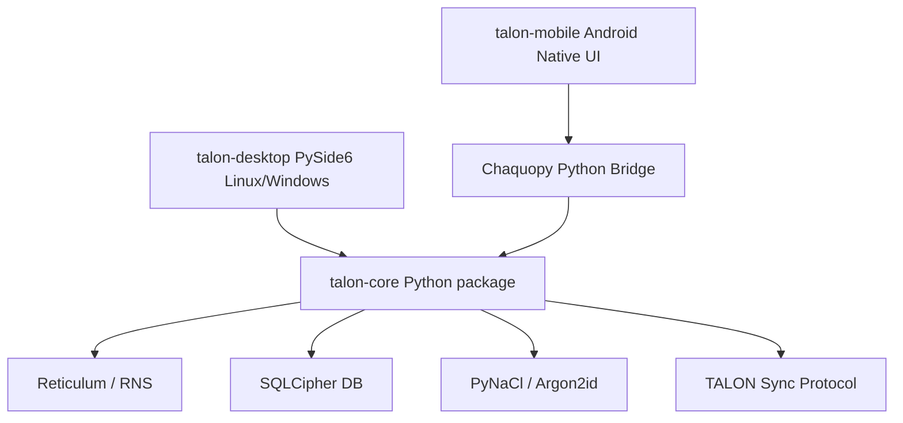
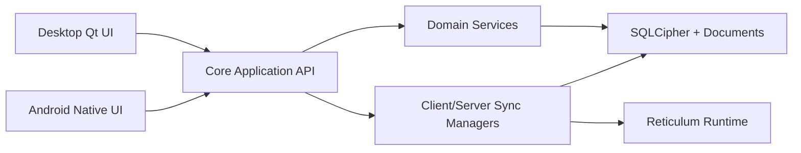
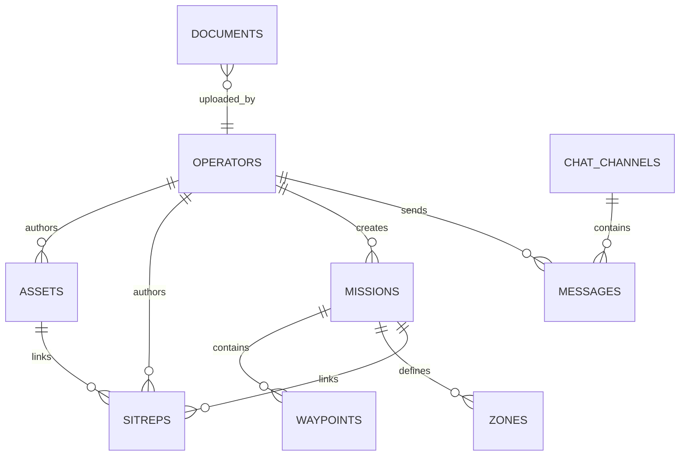

# TALON Platform Split Plan

_Created: 2026-04-26 by Codex._
_Authoritative source for the active wiki rewrite and platform migration._

## Purpose

Split TALON into purpose-built desktop and mobile clients without weakening the Reticulum trust boundary.

Reticulum is non-negotiable. The Python Reticulum implementation remains the networking authority for both desktop and mobile. No client may reimplement or bypass Reticulum for TALON sync, enrollment, lease, revocation, document transfer, or chat traffic.

## Target Projects

| Project | Role | Primary stack | Owns |
|---------|------|---------------|------|
| `talon-core` | Shared Python runtime and domain package | Python | Reticulum/RNS, protocol, crypto, SQLCipher, sync, services, read models |
| `talon-desktop` | Linux/Windows operator UI | Python + PySide6/Qt | Desktop windows, navigation, map UI, dialogs, packaging |
| `talon-mobile` | Android-first field UI | Native Android UI + Chaquopy | Android lifecycle, permissions, foreground service, touch UI, mobile packaging |

Kivy/KivyMD becomes the legacy UI during migration. It is frozen except for emergency release fixes until PySide6 desktop reaches feature parity.

## Project Wikis

Development tracking is split by project:

- [platform_split_checklist.md](platform_split_checklist.md) - master checkbox
  tracker for the full split, including Linux and Windows breakpoints.
- [talon-core/INDEX.md](talon-core/INDEX.md) - shared Python core, Reticulum,
  protocol, DB, crypto, services, read models, and events.
- [talon-desktop/INDEX.md](talon-desktop/INDEX.md) - Linux/Windows PySide6
  desktop client and legacy Kivy release state.
- [talon-mobile/INDEX.md](talon-mobile/INDEX.md) - Android native UI,
  Chaquopy bridge, mobile lifecycle, and Reticulum feasibility work.

Legacy root documents were distilled into these project wikis and archived under
[archive/legacy/](archive/legacy/). The root [INDEX.md](INDEX.md) is now only a
navigation and cross-project status hub.

## Architecture Decisions

- Extract shared backend logic from current `talon/` modules into `talon-core` before building new clients.
- Keep Reticulum identities, RNS config paths, interface setup, path handling, links, sync routing, RNode/Yggdrasil/I2P/TCP interface logic, and document transfer inside `talon-core`.
- Build `talon-desktop` as a PySide6 app that imports `talon-core` directly in-process.
- Build `talon-mobile` as an Android UI shell that embeds Python through Chaquopy and calls `talon-core` through a narrow local API.
- Do not implement a Dart/Kotlin/Rust Reticulum clone. Any future non-Python Reticulum option requires a separate audited compatibility project before TALON can depend on it.
- Preserve the existing wire protocol and SQLCipher schema during the split. Clients must remain sync-compatible throughout migration.
- Keep Kivy/KivyMD out of new architecture decisions except as a temporary
  legacy implementation and rollback reference.

## Repo Topology

## Runtime Architecture

## Data Ownership

## Core API Boundary

`talon-core` exposes a UI-safe application boundary. Desktop and mobile clients do not call low-level Reticulum, database, or crypto modules directly.

Required API groups:

- **Config and session startup**
  - Load a supplied TALON config path.
  - Resolve data, document, and RNS paths.
  - Initialize logging and runtime mode.
  - Open and close SQLCipher databases.
- **Authentication and enrollment**
  - Unlock local database from passphrase.
  - Create server bootstrap state.
  - Start client enrollment from `TOKEN:SERVER_HASH`.
  - Expose lease, revocation, and lock state.
- **Sync lifecycle**
  - Start/stop server net handler.
  - Start/stop client sync manager.
  - Expose connection status, heartbeat status, pending outbox counts, and last sync time.
  - Keep all RNS identity and link handling inside core.
- **Domain service commands**
  - Create/update/delete assets through service commands.
  - Create/delete SITREPs through service commands.
  - Create/approve/reject/abort/complete/delete missions through service commands.
  - Send/delete chat messages and channels.
  - Upload/fetch/delete documents through the existing security pipeline.
  - Renew/revoke operators through server-only service commands.
- **Read models**
  - Provide UI-ready lists/details for assets, missions, SITREPs, chat, documents, operators, audit, map overlays, and dashboard summaries.
  - Return plain Python DTOs/dataclasses with decrypted display fields where policy allows.
  - Keep UI-specific widget classes out of core.
- **Event stream**
  - Emit core events for UI refresh, unread badges, sync status, lease lock, revocation lock, FLASH overlays, and opt-in audio alert triggers.
  - Events must be delivery-safe for both Qt signal adapters and Android/Chaquopy callbacks.

## Migration Phases

### Phase 1: Core Extraction

Goal: make the backend UI-independent while the Kivy app still runs.

Status on 2026-04-26: complete for the current source tree. The
`talon_core.TalonCoreSession` facade now owns startup/unlock/sync lifecycle,
core commands, read models, and events for the main program functions while the
legacy Kivy screens consume that facade. Physical split hardening is complete:
backend implementations now live under `talon_core`, legacy backend imports
under `talon/` are compatibility shims, and `talon_desktop` imports the core
package directly.

- Move or repackage current config, DB, crypto, Reticulum, protocol, sync, services, document, chat, asset, mission, SITREP, map-context, and operator logic into `talon-core`.
- Introduce a `TalonCoreSession` facade for app startup, auth, sync lifecycle, service commands, read models, and events.
- Replace direct Kivy screen calls into low-level modules with calls through the core facade where practical.
- Keep existing tests green before any UI replacement.
- Add core facade tests for login, enrollment, sync startup/stop, service command dispatch, event emission, and read models.

Exit criteria:

- Existing test suite passes. Verified 2026-04-27 with `pytest -q`, 255 tests.
- Kivy app remains the compatibility client using the extracted core facade.
- No UI module imports are required by `talon-core`.
- Reticulum config, identity, and network behavior are unchanged.

### Phase 2: Desktop PySide6 Shell

Goal: replace Kivy on Linux desktop first, polish an accepted Linux
server/client release, then validate Windows.

Status on 2026-04-26: started. The repo now contains an initial
`talon_desktop` package with a PySide6 entry point, unlock/enrollment/lock
shell, main navigation, read-model pages for the major functions, and a
core-event-to-Qt adapter. The desktop dependency extra has been split away from
legacy Kivy/KivyMD so `.[desktop]` installs the PySide6 path without resolving
KivyMD. The first feature workflow, SITREP feed/composer with opt-in audio
state and alert dialogs, is implemented. The Assets workflow now has a Qt table,
detail panel, create/edit dialog, verification controls, client deletion
request, and server hard-delete wiring. The Map workflow now renders local
operational overlays for assets, zones, mission routes/waypoints, and
asset-linked SITREPs. The Missions workflow now has list/detail, create,
requested asset, AO/route input, and server lifecycle controls. The Chat
workflow now has channel/message navigation, composer, channel creation,
direct-message creation, server delete controls, urgent rendering, and the
Phase 2b DM security notice. The Documents workflow now has list/detail, server
upload, download/save, server delete, macro-risk warnings, and document error
surfacing. Operators/server admin now covers operator list/detail,
profile/skills editing, enrollment tokens, pending tokens, server hash, lease
renewal, revocation, audit log viewing, and key/identity status. Feature parity
refinements, drawing tools, Linux packaging, and Windows validation remain open.
The Map page now includes selectable live OSM, TOPO, and Satellite raster base
layers; offline tile packaging/pre-cache remains deferred. Linux Breakpoint A
development-shell validation passed locally:
server and client unlock paths smoke-tested, and same-machine Reticulum TCP
loopback completed enrollment plus server-to-client asset sync. Linux Breakpoint
B has started with a PySide6 Linux PyInstaller spec, installer script, manual
GitHub Actions workflow, and local `talon-desktop-linux.tar.gz` package smoke
for server/client modes. Target Linux Mint install/launch validation passed
without the old Kivy/SDL/GLX startup failure; package-level Reticulum loopback
enrollment/sync also passed from the packaged artifact and an extracted
installed package. Linux Breakpoint B is complete. As of 2026-04-27, the next
Phase 2 priority is a polished Linux server/client release candidate before
Windows packaging starts.

- Create `talon-desktop` with PySide6 application shell, login/lock window, main dashboard, nav, map area, context panels, dialogs, and alert overlays.
- Use `talon-core` in-process.
- Implement the desktop UI in this order:
  1. Login/unlock/lock.
  2. Main dashboard navigation.
  3. SITREP feed/composer and opt-in audio behavior.
  4. Assets and map overlays.
  5. Missions and routes/zones.
  6. Chat.
  7. Documents.
  8. Server admin screens.
- Package Linux desktop first; polish and accept the Linux server/client release
  before Windows packaging starts.
- Retire PyInstaller/Kivy-specific release work only after PySide6 desktop passes acceptance.

Exit criteria:

- Linux PySide6 app can run server and client modes.
- Linux package installs and launches on the target Linux Mint environment without SDL/GLX failure.
- Linux server/client release candidate is accepted after polish and operator
  workflow validation.
- Desktop feature coverage reaches current Kivy Phase 2 core behavior.
- Windows packaging is validated after the accepted Linux release.

### Phase 3: Mobile Android/Chaquopy Spike

Goal: prove Reticulum can run safely inside the Android app before committing to full mobile UI.

- Create a minimal Android app using native Android UI and Chaquopy.
- Embed `talon-core` and initialize a mobile-isolated config/data/RNS directory.
- Validate Python imports and native dependencies:
  - `RNS`
  - SQLCipher binding
  - PyNaCl/cryptography/Argon2
  - document cache dependencies
- Validate Reticulum behavior:
  - create/load identity
  - initialize RNS config
  - start a foreground service for long-running sync
  - perform loopback or TCP Reticulum sync
  - verify no sync traffic bypasses RNS
- Validate Android integration:
  - app private storage paths
  - permissions needed for network, foreground service, notifications, USB/Bluetooth/RNode follow-up
  - lifecycle pause/resume behavior

Exit criteria:

- Android debug build initializes `talon-core`.
- Android debug build initializes Reticulum and can complete a loopback or TCP sync test.
- Core dependencies package reproducibly.
- Known blockers are documented before full mobile UI starts.

### Phase 4: Full Mobile App

Goal: build a field-first Android client using the proven embedded Python core.

- Keep mobile UI client-only at first; server/admin functionality stays desktop-only unless explicitly approved later.
- Prioritize touch-first workflows:
  1. Unlock/enrollment/lease lock.
  2. Map-first operational dashboard.
  3. SITREP create/feed/FLASH overlay.
  4. Mission view and status.
  5. Asset view/create/update.
  6. Chat.
  7. Document fetch/cache.
- Implement mobile event adapter from `talon-core` to Android UI state.
- Use Android foreground service for sync while the app is active or explicitly operating in field mode.
- Keep RNode/USB/Bluetooth handling behind a dedicated Android integration layer that calls core only through approved interfaces.

Exit criteria:

- Android client can enroll, sync, operate offline, push pending records, fetch documents, and lock on revocation/lease failure.
- Mobile UI does not access SQLCipher or Reticulum internals directly.
- Reticulum remains the only TALON sync transport path.

### Phase 5: Kivy Retirement

Goal: remove Kivy from release paths after replacement clients are accepted.

- Stop publishing Kivy Linux artifacts.
- Archive Kivy UI code or move it to a legacy branch after PySide6 desktop reaches parity.
- Remove Kivy/KivyMD dependencies from active desktop release packaging.
- Keep migration notes and rollback instructions in the wiki until at least one desktop and one mobile release are proven.

Exit criteria:

- Active release artifacts are PySide6 desktop and Android/Chaquopy mobile.
- Kivy is no longer required to run or package supported clients.
- Wiki and release notes clearly identify the new project topology.

## Risk Register

| Risk | Impact | Mitigation |
|------|--------|------------|
| Reticulum cannot run reliably under Android/Chaquopy | Mobile app blocked | Run Phase 3 spike before full mobile implementation |
| Python native dependencies fail Android packaging | Mobile app blocked or reduced | Validate `RNS`, SQLCipher, PyNaCl, cryptography, and Argon2 in spike |
| Core extraction accidentally changes sync behavior | Data loss or sync drift | Preserve schema/wire protocol; require existing tests green before UI migration |
| Desktop rewrite misses hidden Kivy behavior | Feature regression | Build read-model/API tests and screen-by-screen acceptance checklist |
| Mobile lifecycle kills sync unexpectedly | Missed updates | Use Android foreground service for active field sync; expose status/lock events |
| Multiple repos drift | Protocol incompatibility | Make `talon-core` the only owner of protocol/schema/sync; clients depend on versioned core releases |

## Acceptance Criteria

### Core

- Existing test suite passes after extraction.
- New core facade tests cover auth, enrollment, sync lifecycle, service commands, read models, and event delivery.
- No UI framework imports exist in `talon-core`.
- Reticulum use remains centralized and auditable.

### Desktop

- PySide6 Linux client and server modes launch on target Linux Mint machines.
- Desktop can complete enrollment, bidirectional sync, offline outbox push, revocation lock, document fetch/cache, SITREP alert overlay, chat, assets, and missions.
- Windows desktop package is validated after Linux acceptance.

### Mobile

- Android/Chaquopy spike proves `RNS` initialization and at least one Reticulum-backed sync path.
- Android client uses app-private TALON data/RNS/document paths.
- Mobile UI communicates with Python core through the approved local API only.
- No TALON sync path bypasses Reticulum.

## Assumptions

- `wiki/platform_split_plan.md` is local project state under the current `.gitignore` rules unless it is force-added or ignore rules change.
- Android is the first mobile target. iOS is out of scope until Android proves embedded Reticulum viability.
- Linux is the first PySide6 desktop target. Windows follows after Linux desktop acceptance.
- Kivy remains available only as a temporary legacy UI during migration.
- DM E2E encryption remains Phase 2b and should be implemented in `talon-core`, not client-specific UI code.
