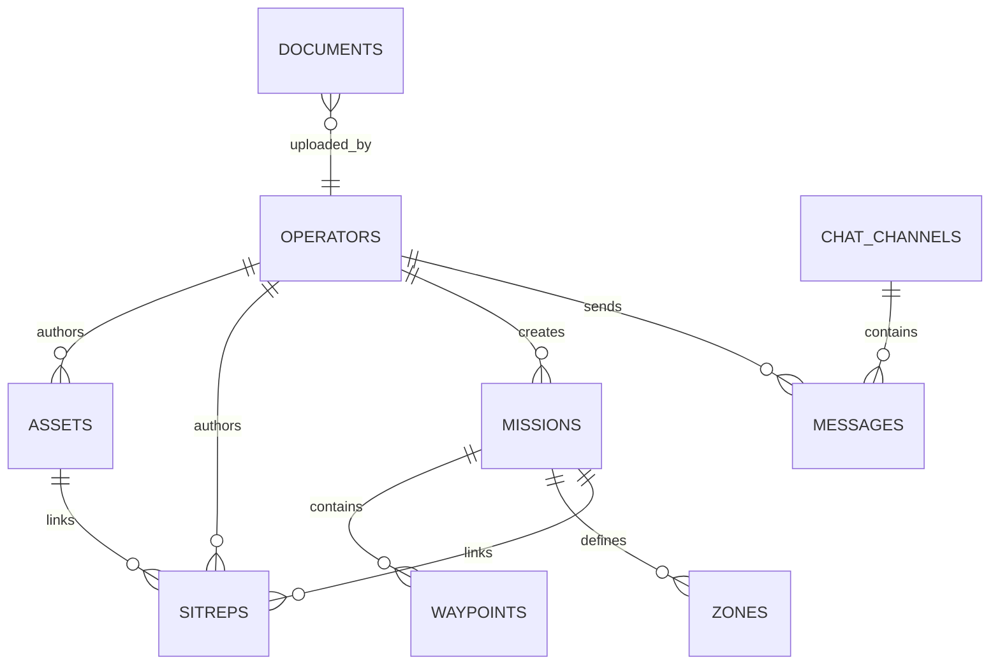

# Data Model

Core owns entity schemas, migrations, DTO/read-model shapes, and cross-entity
integrity rules.

## Current Schema State

- Current monolith schema version: v15.
- Migrations are embedded Python string literals so they package with Android and
  desktop builds.
- SQLCipher connection enables foreign keys and uses serialized write handling.
- Client-pushable records use UUID identity and `sync_status`.

## Read Model Rule

Core should return UI-ready read models for every screen without exposing raw DB
cursor behavior. Clients can format layouts, but they should not duplicate
business joins, ownership policy, or decryption rules.

## Ownership Rule

Author/operator fields must resolve through the enrolled local operator. Client
actions must not silently fall back to the server sentinel.
